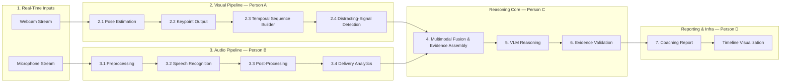

# InterviewLens

Real-time multimodal interview preparation and feedback pipeline.

InterviewLens watches a mock-interview response (webcam video + microphone
audio) and produces an evidence-grounded coaching report: what you said, how
you said it, what your body language was doing, and concrete suggestions for
improvement — all backed by explicit, checkable evidence rather than
free-form LLM opinion.

> Add the original architecture diagram image to `docs/architecture.png`.
> The pipeline stages below mirror that diagram 1:1.

## Pipeline overview



## Repository layout

```
src/interviewlens/
├── common/           # shared schemas + config — read by everyone, owned by no one
├── video_pipeline/   # Person A — pose estimation, keypoints, temporal windows, signal detection
├── audio_pipeline/   # Person B — capture, ASR, post-processing, delivery analytics
├── reasoning/        # Person C — evidence fusion, VLM reasoning, evidence validation
├── reporting/        # Person D — coaching report, timeline visualization
├── orchestration/    # Person D — wires all four subsystems together
└── api/              # Person D — FastAPI server
```

See [ROLES.md](ROLES.md) for the full 4-person task breakdown, interfaces,
milestones, and definition of done for each role.

## Quickstart

```bash
python -m venv .venv
.venv\Scripts\activate        # Windows
pip install -r requirements.txt
pip install -e .

# Runs the full pipeline end-to-end with synthetic audio/video and mocked
# models (demo_mode) — no camera, microphone, or GPU required.
python scripts/run_demo.py

# Run the test suite
pytest -q

# Serve the API
uvicorn interviewlens.api.server:app --reload
```

## Design principle: mock-first, swap-in-real-models-later

Every model-backed component (`PoseEstimator`, `SignalDetector`, `ASRModel`,
`VLMReasoner`) has a stable abstract interface plus a working mock
implementation. This means:

- The whole pipeline runs and is testable from day one, before any real
  model is trained.
- Each person can develop, train, and swap in their real model without
  touching anyone else's code — only the shared `common/schemas.py`
  contracts need to stay stable.
- Champion/challenger model pairs (documented per-stage in
  `configs/config.yaml`) can be A/B compared using the exact same
  downstream pipeline.

## License

Add a license appropriate for your course/project (e.g. MIT) before making
the repository public.
