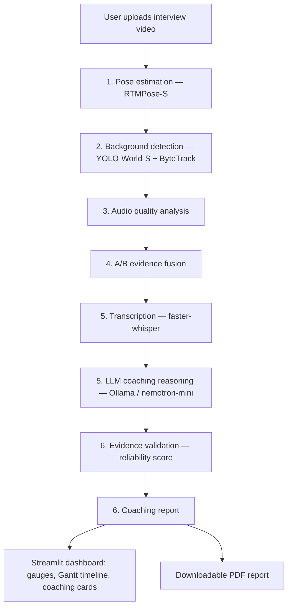

# InterviewLens

Evidence-grounded AI interview coaching. Upload a mock-interview video and
InterviewLens produces a coaching report — what you said, how you said it,
what your body language was doing, and concrete suggestions for improvement —
backed by explicit, checkable evidence rather than free-form LLM opinion.

## Quickstart

```bash
python -m venv .venv
source .venv/bin/activate     # Windows: .venv\Scripts\activate
pip install -r requirements.txt
pip install -e .

# Also required (system binary, not pip-installable):
#   ffmpeg + ffprobe on PATH — used to decode the uploaded video's audio track.

# Pull the local LLM used for coaching reasoning (one-time, ~2.7 GB):
ollama pull nemotron-mini
ollama serve

# Launch the app
streamlit run scripts/app.py
```

Upload an interview video (MP4/MOV/AVI/WebM/MKV, up to 500 MB) and click
**Run Analysis**. The dashboard shows pose/framing/background signal
timelines, delivery metrics, LLM coaching cards, and a downloadable PDF
report.

## What it actually does?

| Stage | Model | Output |
|---|---|---|
| Pose & framing | RTMPose-S (ONNX, bundled weights) | 17-keypoint skeleton, geometric signal rules (head tilt, body lean, hands near face, etc.) |
| Background | YOLO-World-S + ByteTrack | Object detection/tracking, clutter and lighting signals |
| Speech | faster-whisper | Transcript, filler words, pauses, speaking rate |
| Coaching reasoning | Ollama (nemotron-mini, local) | Evidence-grounded observations, explanations, suggestions |
| Evidence validation | Rule-based | Reliability score — flags/downweights ungrounded LLM claims |

Model weights for RTMPose-S and YOLO-World-S are bundled in the repo (see
`requirements.txt` for exact paths); Ollama's LLM is pulled separately.

## Workflow



Background detection needs pose's per-frame subject bounding box (to keep the
interviewee's own body from registering as clutter), so stage 2 always runs
after stage 1. Every stage runs real inference on the uploaded video's actual
frames/audio — no synthetic or mocked data anywhere in this path.

## Repository layout

```
scripts/app.py               # the Streamlit app — main entry point
src/interviewlens/
├── common/           # shared schemas + config
├── video_pipeline/   # pose estimation, framing/background signal detection
├── audio_pipeline/   # audio extraction, ASR, delivery analytics
├── reasoning/        # evidence fusion, LLM reasoning, evidence validation
├── reporting/        # coaching report assembly
├── orchestration/    # end-to-end pipeline wiring (demo/synthetic-data path)
└── api/              # FastAPI server (demo/synthetic-data path)
```

See [ROLES.md](ROLES.md) for the original 4-person task breakdown and
per-subsystem interfaces.

## Testing

```bash
pytest -q
```

## License

[Apache License 2.0](LICENSE).
